# Facedancer21 使用手册

Facedancer21 是一个开源项目，由 Great Scott Gadgets 创建，设计目的是为了模拟任意 USB 设备，从而测试 USB 主设备的各种特性。

## 硬件解析

Facedancer21 硬件完全开源，硬件架构为：**USB 转串口芯片 FT232 → 单片机 MSP430F2618TPM → USB 模拟芯片 MAX3421**，原理图如下：

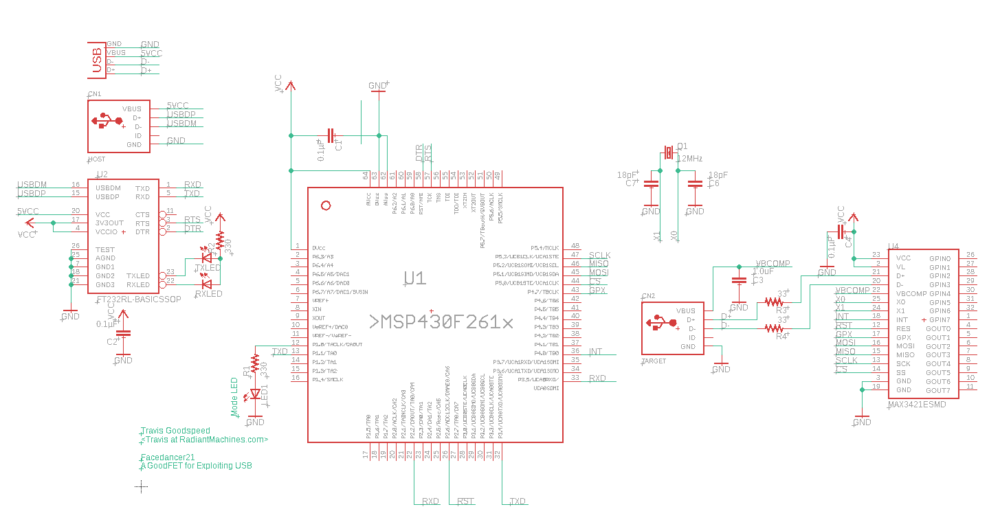

这块板子的设计也许启发了后世某位同学——注意**直角走线**，PCB 图如下：

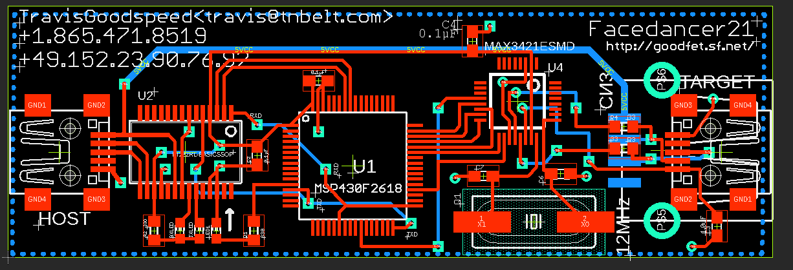

电路上，FT232 负责将 USB 通信转换为串口，MSP430 单片机的作用是控制 MAX3421 芯片模拟各种 USB 设备。有趣的是，设计者利用了 MSP430 芯片的一个 BUG（或者说隐藏用法），可以直接使用 FT232 芯片为 MSP430 单片机烧录程序。

MSP430 单片机通过 SPI 总线控制 MAX3421 芯片，MAX3421 负责模拟任意的 USB 设备。

### 硬件改版

原版 Facedancer21 硬件似乎是为了在家蚀刻电路板而设计的，器件布局和接口选型都不太理想。我参照电路图重新设计了一版：

- 符合 USB 差分布线标准
- 原理图与官方版本完全相同，仅重新布局
- 将控制侧过时的 Mini USB 接口替换为 Type-C 接口，获得更好的体验

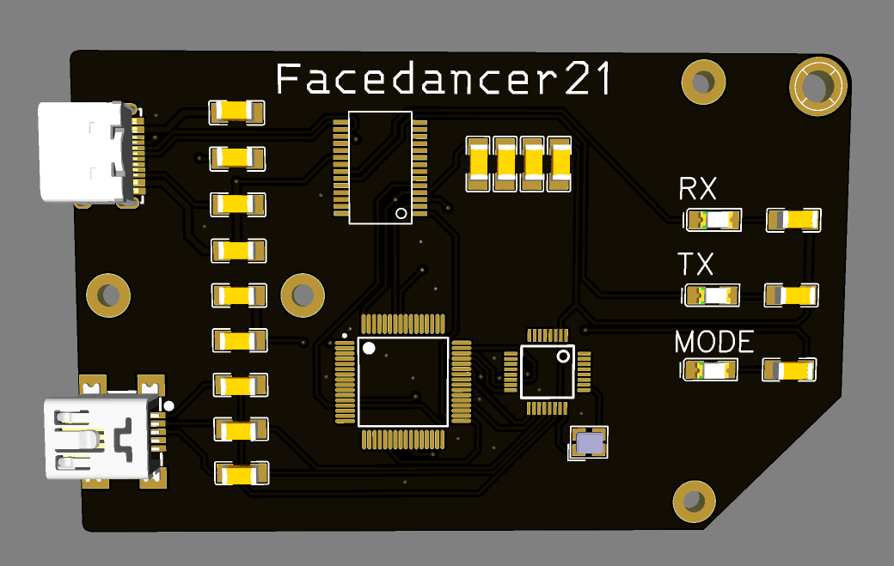

我也为这台设备设计了新的外壳。下图中：
- **左上角**：控制侧接口（Type-C）
- **左下角**：被控制侧接口（Mini USB）

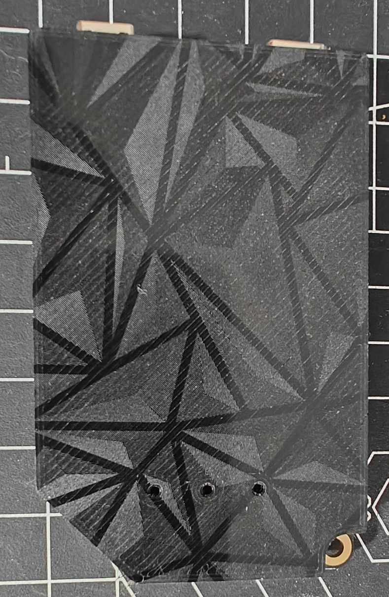

相较于原版，新版设计更不易损坏，布局布线更为合理。本教程与设备版本无关（硬件原理图相同），但后续图例均拍摄自我的改版。

---

## 烧录程序

Facedancer21 的相关资料都提到需要进行一次编译，但由于固件应该不会再有什么更新了，直接使用预编译固件就好。

### ⚠️ 重要提示

Facedancer21 的软件都基于 **Python 2**，这意味着很难在现在的系统环境中找到合适的运行环境。建议找一个预装 Python2 、但目前仍有软件源可以更新的系统。我选择使用**树莓派 + 五年前的 Buster 系统**来驱动 Facedancer21。
如果你使用虚拟机，搭配几年前的乌班图或者其他系统，请尽量在练手的时候不要把攻击侧和防守侧都接到同一个机器上，因为测试过程中USB的相关部分可能会直接重启，或者机器蓝屏，尽量使用两台电脑进行测试。

### 系统下载

**Raspberry Pi OS Buster 下载地址**：

```
https://downloads.raspberrypi.com/raspios_armhf/images/raspios_armhf-2020-05-28/2020-05-27-raspios-buster-armhf.zip
```

### 环境搭建

#### 1. 安装必要软件

```bash
sudo apt update && sudo apt install git python2 curl -y
```

#### 2. 为 Python 2 安装 pip

```bash
curl https://bootstrap.pypa.io/pip/2.7/get-pip.py --output get-pip.py
sudo python2 get-pip.py
```

安装成功后，运行 `pip2 --version` 确认能看到版本号。

#### 3. 安装依赖库

```bash
python2 -m pip install pyserial --user
```

### 下载项目并烧录固件

#### 1. 克隆项目

```bash
git clone https://github.com/greatscottgadgets/facedancer
```

> 预编译固件位于 `facedancer21/firmware/prebuilt`，烧录工具在 `client` 文件夹下。

#### 2. 烧录固件

在 `facedancer` 文件夹下执行：

```bash
python2 client/goodfet.bsl -e -p firmware/prebuilt/facedancer21.hex
```

> **注意**：这种烧录方式利用的是 MSP430 芯片的一个漏洞（不够正规），可能需要烧录好几次才能成功一次。

#### 3. 成功烧录的报文示例

```
Board not specified.  Defaulting to goodfet41.
Press Ctrl+C to cancel, or Enter to continue.   # 此处需要按一次回车
MSP430 Bootstrap Loader Version: 1.39-goodfet-8
Invoking BSL...
Transmit default password ...
Current bootstrap loader version: 2.12 (Device ID: f26f)
Checking for info flash...  None.
Look at contrib/infos/README.txt for better performance.
Mass Erase...
Transmit default password ...
Invoking BSL...
Transmit default password ...
Current bootstrap loader version: 2.12 (Device ID: f26f)
Program ...
5374 bytes programmed.
```

---

## 安装软件

虽然官方提供了一些测试脚本，但实际使用中主要依赖第三方工具——**umap2**。

### 安装 umap2

```bash
pip2 install setuptools
pip2 install git+https://github.com/nccgroup/umap2.git#egg=umap2
```

### 验证安装

```bash
umap2list
```
正确输出
```bash
pi@raspberrypi:~ $ umap2list
audio
billboard
cdc_acm
cdc_dl
ftdi
hub
keyboard
mass_storage
mtp
printer
smartcard

```

如果提示找不到命令，可以手动添加 PATH 或使用以下方式运行：

```bash
python2 -m umap2.apps.list_classes
```
---

## 上手使用

### fuzzing测试是什么

fuzzing测试也叫模糊测试，对facedancer21而言，就是给USB发送异常的，随机的，非预期的数据，来发现设备的漏洞。

### 第一步：明确测试目标并扫描宿主机

如果你需要确定想测试宿主机的哪个驱动程序或设备类别（如键盘、大容量存储），首先连接你的facedancer21到控制机上，之后连接facedancer21的miniUSB接口到，被测试机上，运行 `umap2scan` 命令查看宿主机支持哪些USB设备类：

```bash
#没有太多USB设备连接的情况下，设备地址一般为 /dev/ttyUSB0
#由于umap2支持其他软件，需要在地址前加前缀 fd:
umap2scan -P fd:/dev/ttyUSB0
```

**注意，你的facedancer21可能在其他接口上，使用“ls -l /dev/tty*”来获取你的设备的信息。*’

在我windows10电脑上面的扫描结果如下，大量的测试信息已经省略掉
```bash
[ALWAYS] Device is SUPPORTED
[ALWAYS] ---------------------------------
[ALWAYS] Found 7 supported device(s):
[ALWAYS] 1. audio
[ALWAYS] 2. cdc_acm
[ALWAYS] 3. hub
[ALWAYS] 4. keyboard
[ALWAYS] 5. mass_storage
[ALWAYS] 6. printer
[ALWAYS] 7. smartcard

```


### 第二步：记录一次正常的通信流程（制作模板）

为了让模糊测试更有效，需要先记录宿主机与正常设备之间一次典型的通信过程，将其作为后续生成“异常”数据的模板。

使用 `umap2stages` 命令来完成记录：

```bash
umap2stages -P fd:/dev/ttyUSB0 -C <CLASS> -s <STAGES_FILE_NAME>
```

| 参数 | 含义 | 示例 |
| :--- | :--- | :--- |
| `-C <CLASS>` | 要模拟的设备类别 | `-C keyboard` |
| `-s <FILE>` | 保存通信流程记录的文件名 | `-s keyboard_stages.json` |

运行下“umap2stages -P fd:/dev/ttyUSB0 -C keyboard-s keyboard_stages.json”
在一大堆眼花缭乱的输出之后我得到了“keyboard_stages.json”,内容如下
```bash

device_descriptor
device_descriptor
configuration_descriptor
interface_descriptor
hid_descriptor
hid_report_descriptor
endpoint_descriptor
string_descriptor
string_descriptor_zero
string_descriptor
device_descriptor
configuration_descriptor
interface_descriptor
hid_descriptor
hid_report_descriptor
endpoint_descriptor
configuration_descriptor
interface_descriptor
hid_descriptor
hid_report_descriptor
endpoint_descriptor
hid_set_idle_response
hid_report_descriptor
string_descriptor_zero
string_descriptor
string_descriptor
configuration_descriptor
interface_descriptor
hid_descriptor
hid_report_descriptor
endpoint_descriptor
configuration_descriptor
interface_descriptor
hid_descriptor
hid_report_descriptor
endpoint_descriptor


```

### 第三步：启动模糊测试

此步骤需要**同时运行两个工具**，建议在两个独立的终端窗口中操作。

**在 Python 2 环境下，最新版 kittyfuzzer 处理某些变异数据时会出现 UnicodeDecodeError，建议降级至 0.6.9 版本**
    ```bash
    pip2 uninstall kittyfuzzer -y
	pip2 install kittyfuzzer==0.6.9
    ```


1.  **启动模糊测试后端 (Kitty)**
    在第一个终端中，启动Kitty模糊测试框架的后端服务，它会根据你记录的模板生成测试用例。
    ```bash
    umap2kitty -s <STAGES_FILE_NAME>
    ```

    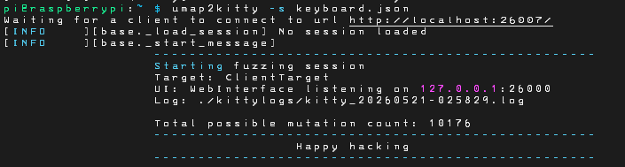

2.  **启动模糊测试前端 (umap2fuzz)**
    在第二个终端中，启动 `umap2fuzz`。它会与Kitty后端通信，并通过你的Facedancer21硬件将变异后的测试数据包发送给宿主机。
    ```bash
    umap2fuzz -P fd:/dev/ttyUSB0 -C <CLASS>
    ```
	
    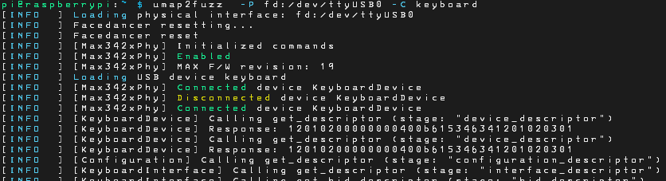	
	
#### 监控测试进度与结果

命令行输出并非用来实时查看。官方推荐使用Kitty的Web界面来监控。

在运行kittyfuzzer的机器的浏览器中打开 `http://127.0.0.1:26000/` ，即可进入后台。

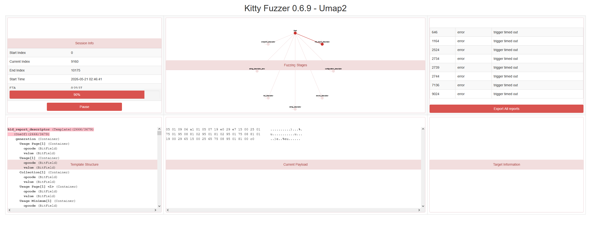

在这个Web界面中，你可以：
*   **监控测试状态**：查看当前正在执行的测试用例编号。
*   **查看失败报告**：当某个测试用例导致目标（或你的模拟器）出现异常时，这里会记录详情，是定位漏洞的关键信息。

假设想在其他电脑上打开该网页，请建立一个ssh隧道把运行fuzz的机器的26000端口映射到本地，Windows 上面使用 Powershell ，linux 上面直接使用终端。
    
	```bash
    ssh -L 26000:127.0.0.1:26000 <运行fuzz工具的机器的用户名>@<运行fuzz工具的IP地址>
    ```
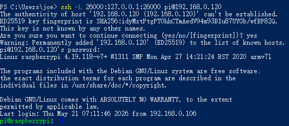

> 需要输入运行fuzz的机器的密码

#### 下载错误报告

在网页的右上方会显示各类错误，点击 **Export All reports** 可以下载报错文件。

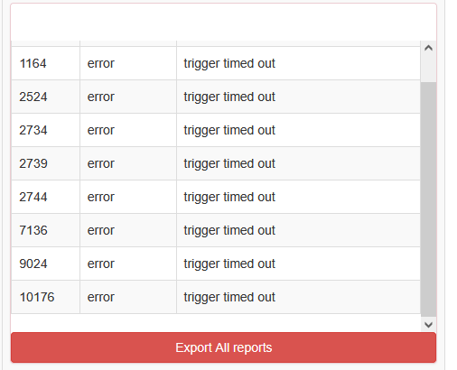

点击每一个单独的报告可以看详细的报告

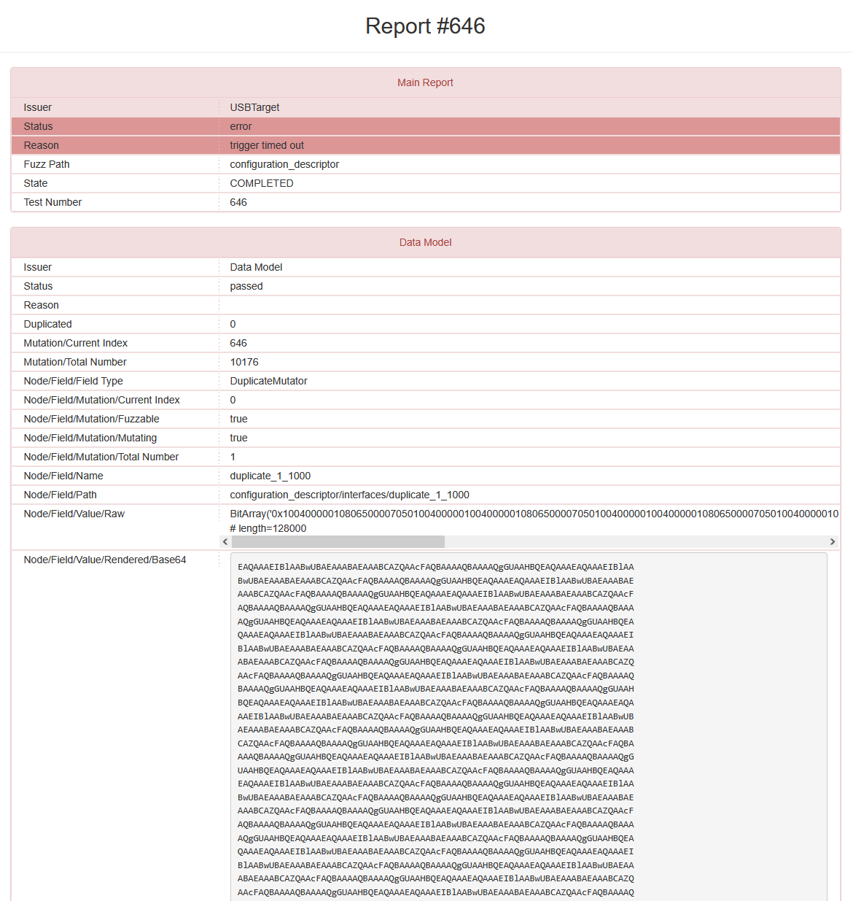

| 字段 | 值 | 含义 |
|------|-----|------|
| **Status** | `error` | 测试失败 |
| **Reason** | `trigger timed out` | 目标主机没有响应（超时） |
| **Test Number** | `646` | 失败用例编号，复现bug需要使用该编号 |
| **Fuzz Path** | `configuration_descriptor` | 问题发生在 USB 配置描述符 |
| **Node/Field/Name** | `duplicate_1_1000` | 变异器名称：重复（Duplicate） |
| **Node/Field/Field Type** | `DuplicateMutator` | 变异类型：复制/重复数据 |
| **Raw Data Length** | `128000` bits ≈ 16KB | 发送的畸形数据大小 |

### 第四步、错误复现

在两个终端中分别按下 **Ctrl+C** 关掉原有的软件
在终端1中运行

	···bash
	umap2kitty -s keyboard.json -k "-s <错误编号> -e <错误编号>"
	```

在终端2中运行

	···bash
	umap2fuzz -P fd:/dev/ttyUSB0 -C keyboard
	```
	
> 该指令中的 **-s** 和 **-e** 为测试编号的开始和结束，只测试某一个编号的情况下，填写同一个值即可

再次打开网站，查看进度

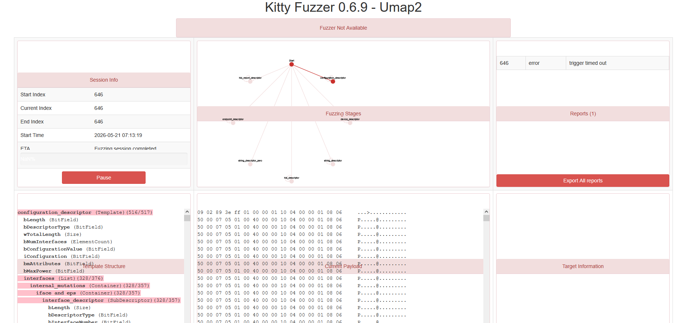

fuzz测试成功复现，**恭喜，你成功触发了一个 USB 驱动的异常！**

具体来说：
1. Facedancer21 发送了一个**被大量重复数据填充的畸形配置描述符**（约 16KB，正常只有几十字节）
2. 目标主机（被测试的电脑）在收到这个描述符后**卡住了**，没有在规定时间内回复
3. 这很可能是一个**拒绝服务 (DoS) 漏洞**：精心构造的 USB 描述符可以让目标系统的 USB 驱动崩溃或挂起

## Facedancer21 USB Fuzzing 测试总结

### 一、测试概述

本次测试使用 Facedancer21 硬件配合 umap2 软件框架，对目标主机的 USB 协议栈进行了全面的模糊测试（Fuzzing）。测试环境为 Windows 11 主机，共执行 **10177 个变异测试用例**，耗时完成完整测试周期。

### 二、测试发现

#### 2.1 核心发现

测试过程中共记录 **9 次失败事件**（Failure count: 9），其中最具代表性的是 **Test #646**：

| 项目 | 详情 |
|------|------|
| 失败原因 | `trigger timed out`（触发超时） |
| 问题位置 | USB 配置描述符（configuration_descriptor） |
| 变异类型 | DuplicateMutator（数据重复变异器） |
| 发送数据量 | 约 16KB（正常 USB 描述符仅几十字节） |
| 变异参数 | 将特定数据重复复制 **36 次** |

#### 2.2 问题分析

该测试用例向目标主机发送了一个**被大量重复数据填充的畸形配置描述符**。正常 USB 设备的配置描述符长度通常在 9-255 字节之间，而本次发送的数据量远超正常范围（16KB）。目标主机在收到该描述符后未能按时响应，触发超时错误。

这表明：
- 目标主机的 USB 驱动在解析异常长度的描述符时可能存在**缓冲区处理缺陷**
- 畸形描述符可能导致驱动进入**异常状态或挂起**
- 此类问题具有潜在的**拒绝服务（DoS）风险**

### 三、实际应用场景与价值

本次测试虽然在 Windows 11 环境下完成，但 Facedancer21 的应用场景远不止于此。实际测试目标往往包括：

| 目标设备类型 | 典型场景 | 测试意义 |
|-------------|---------|---------|
| **车机系统** | 车载娱乐系统、智能座舱 | 车辆 USB 接口可能被恶意 U 盘攻击，导致系统卡顿或黑屏 |
| **嵌入式主机** | 工业控制器、医疗设备、POS 机 | 这类设备通常不便于打补丁，需在出厂前验证 USB 驱动健壮性 |
| **Android 设备** | 手机、平板、电视盒子 | 发现 USB 驱动漏洞，防止提权或系统崩溃 |
| **Linux 系统** | 各类物联网网关、路由器 | 验证不同内核版本的 USB 驱动安全性 |
| **游戏主机** | PS、Xbox、Switch | 防止通过 USB 外设进行越狱或系统破坏 |

### 四、测试价值与意义

通过 USB Fuzzing 测试，可以实现以下目标：

#### 4.1 漏洞发现与修复

- **驱动级漏洞**：发现 USB 驱动在处理畸形数据时的缓冲区溢出、空指针解引用等问题
- **协议解析缺陷**：验证设备对异常 USB 描述符的解析是否正确
- **内存安全**：发现因数据长度校验不严导致的内存越界

#### 4.2 设备加固

- **输入验证增强**：根据测试结果，加强 USB 描述符的合法性校验
- **异常恢复机制**：确保设备在收到畸形数据后能优雅降级而非直接崩溃
- **安全开发规范**：为 USB 驱动开发团队提供安全编码参考

#### 4.3 合规与认证

- 满足车规、工控等领域的 **安全认证要求**
- 建立 **USB 安全测试基线**，纳入产品发布流程
- 提供 **第三方安全评估** 的可验证证据

### 五、后续工作建议

1. **扩展测试目标**：在车机系统、Android 设备、嵌入式 Linux 等实际环境中重复本次测试
2. **失败用例验证**：对 9 个失败用例进行逐一复测，确认其可重现性和影响范围
3. **深入分析**：对 Test #646 等典型失败用例，使用调试器（WinDbg、GDB）分析目标系统崩溃时的调用栈
4. **自动化集成**：将 USB Fuzzing 纳入 CI/CD 流程，实现对新版本的持续安全测试

### 六、结语

本次测试验证了 Facedancer21 作为 USB Fuzzing 工具的有效性，成功发现了目标主机在处理畸形 USB 配置描述符时的异常行为。该方法可推广应用于各类嵌入式系统、车机设备及物联网产品的 USB 安全测试中，是发现驱动级漏洞、加固设备安全的有效手段。
